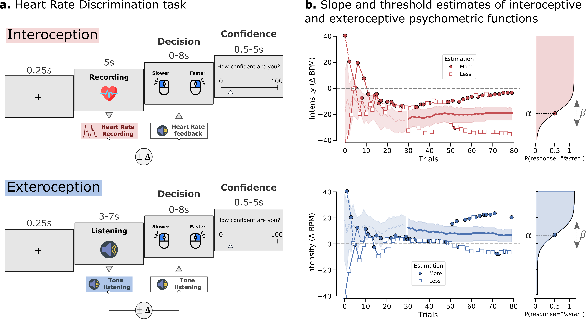
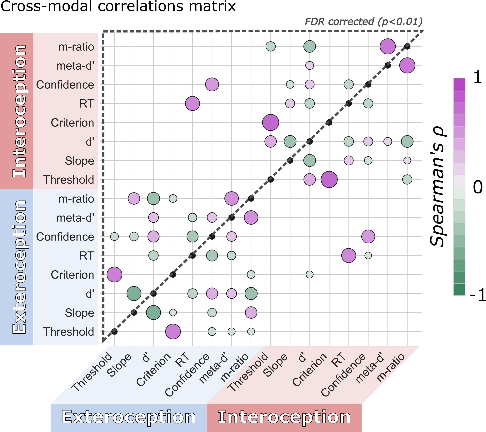
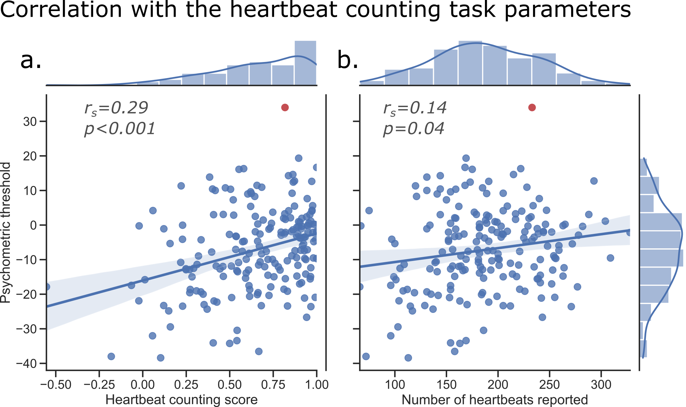

# Cardioception Paper
Data and code for the cardiac interoception method paper.

## Data

Data are stored in the `data` folder:

* `bayesianPsychophysics.txt`: slope and threshold estimates using PyMC3.
  
* `behavior.txt`: summary statisics for group level analysis.
  
* `jagsSamples.txt`: trace samples from the JAGS repeated measures model.

* `jagsStats.txt`: summary statistics from the JAGS repeated measures model.

* `merged.txt`: stacked dataframes for trial level analysis.

* `metacognition_trials.txt`: confidence responses in long format.

* `metadprimeHmetad.txt`: meta-d' scores fron the subject level fit (R).

* `metadprimeMetadPy.txt`: meta-d' scores fron the subject level fit (Python).

## Code

Scripts and jupyter notebooks are tored in the `code` folder.

### Notebooks

* `1 - Importing Files.ipynb` contains basic files import and summary.

* `2 - Psychophysics.ipynb` description of the psychometric functions.

* `3 - Metacognition.ipynb` analysis of the type 2 task results.

* `4 - Bayesian psychophysics.ipynb` Bayesian psychometric models.

* `5 - Correlations.ipynb` Correlations between the HRD and the heartbeat counting task.

### Scripts

#### Python

* `reports.py` generate HTML reports.

* `plotting.py` raincloud plot for repeated measures.

* `summary.py` will will extract summary dataframe from local raw data and create the group level summary dataframe (`Behavior.txt`), the merged dataframe (`Merged.txt`) that can be used for trial level analysis and the metacogintion dataframe (`metacognition.txt`).

#### R

* `run_individualLevel.R` run the hmeta-d model at the individual and condition level.
  
* `run_RepeatedMeasures.R` run the hmeta-d model at the individual and condition level.
  
* `Function_metad_1wayANOVA.R` run the hmeta-d model at the group level with repeated measures.
  
* `run_individualLevel.R` run the hmeta-d model at the individual and condition level.

## Reports

* `HRD` behavioral reports from the Heart Rate Discrimination task. 
## Figures

### Figure 1:

**A. Heart Rate Discrimination Trial Design.** Participants were presented with 160 trials testing their exteroceptive (blue) and interoceptive (red) accuracy and precision (80 in each condition in randomised order). During interoceptive trials, participants were instructed to attend to their own heart rate while it was recorded using a pulse oximeter for 5 seconds. The average heart rate was then computed and used to select the frequency of the tones presented during the decision phase, increased or decreased by an intensity value generated by the staircase, i.e. 𝚫-BPM. During exteroceptive trials, a sequence of tones was presented to the participant with a frequency randomly chosen between 40 and 100 bpm. This frequency was then used to select the beeping frequency of the tones presented during the decision phase, increased or decreased by a value generated by the staircase procedure. 𝚫-BPM values were controlled by separate staircases for each condition. To estimate metacognitive ability for each modality, at the end of each trial, participants were asked to rate their subjective decision confidence (from 0 - uncertain to 100 - certain). **B. Example staircases for each condition from an exemplary subject.** Trials rated as faster or slower are depicted with circles or squares respectively. The shaded area represents the 95CI of the posterior distribution for threshold. On the right panel, the resulting cumulative normal distribution is plotted using the final parameters estimated by the psi procedure.

### Figure 2:

**A. Parameters of the psychometric functions for interoception (red) and exteroception (blue) conditions.** The grey lines show individual subject fits. The dark blue and red lines show the grand mean psychometric function, depicting average threshold and slope. **B. Distribution of slope and thresholds parameters across interoceptive and exteroceptive conditions.** We found that the psychometric functions under the interoceptive condition were characterized by a negatively biased threshold and larger slope on average.

### Figure 3:

**Visualization of metacognitive performance for interoceptive and exteroceptive conditions. A. & B.** Histogram showing the distribution of binned confidence ratings for correct vs error trials. Participants were significantly less confident overall in the interoceptive condition and showed reduced calibration as indicated by the flattening of the confidence distributions. To quantify this effect, we estimated “metacognitive efficiency”, a signal theoretic model of introspective accuracy which controls for differences in type-I (discrimination) performance. Here, an M-ratio of 1 indicates optimal metacognition according to an ideal observer model, whereas values lower than this indicate inefficient use of the available perceptual signal. **C.** This model demonstrated that metacognitive efficiency was substantially decreased for interoceptive relative to exteroceptive judgements. **D.** Histogram of posterior samples from the Hierarchical Bayesian model of metacognition, illustrating a significant difference in M-ratio between the two conditions. 

### Figure 4:

Comparison between online and post hoc Bayesian estimation of slope and threshold parameters of the psychometric functions. Adaptive Bayesian staircases can be biased if their initial parameter settings poorly fit the underlying generative psychometric function, or if a subject makes unrepresentative responses early in the experiment. For example, in this sample we observed that the prior width [0 - 20] on the slope parameter was too low, resulting in a ceiling effect that biased estimates for some subjects. One solution to control for these biases is to implement post hoc Bayesian modelling of the observed psychophysical data. We thus re-analyzed the responses for each participant and for each condition separately using a Bayesian model to fit a cumulative normal distribution. **A.** The thresholds estimates remained stable, although with a reduced variance for the exteroceptive condition. **B.** The ceiling effect on the slope is normalized by the post hoc modelling, which shifts the posterior mass away from the extremes. The post hoc procedure can thus improve the estimation of the interoceptive and exteroceptive psychophysical parameters.

### Figure 5:

**Cross-modal correlation of task modality parameters. A.** Correlation matrix of task parameters for interoception and exteroception. Overall, we observed that behavioural results were correlated within modalities but with limited dependence across modalities, the only exceptions were confidence and response time. Only significant Pearson correlations are represented. The upper triangle only shows results surviving FDR correction, pFDR < 0.05. Colour and size of individual points indicate the sign and strength of estimated correlation coefficients. **B.** Scatterplot of between modalities correlations. We found that confidence between modality was highly correlated, even though objectivity sensitivity was not, suggesting the possibility of (erroneously) shared self-priors. Shaded grey line depicts the least-squares regression +/- 95% bootstrapped confidence interval (1000 iterations). 

### Figure 6:

**Correlation between the psychometric threshold and heartbeat counting performances.** We found that participants’ performances at the interoceptive condition of the heart rate discrimination task were correlated with the score at the heartbeat counting task (left panel). A lower threshold (i.e., a more extreme bias) at the heart rate discrimination task was associated with a lower performance during heartbeat counting. No association was observed between the exteroceptive threshold and the heartbeat counting task performances. The psychometric threshold was also associated with more total beats counts during the heartbeat counting task (right panel), but this association was not found for the exteroceptive threshold. These results suggest that participants’ inability to reliably count their heartbeats is partially explained by lower interoceptive thresholds and a global underestimation heart rate for these participants.

### Supplementary Material:
